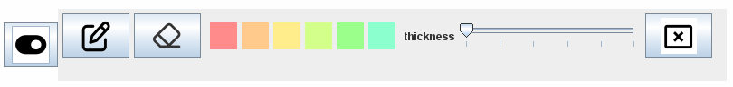
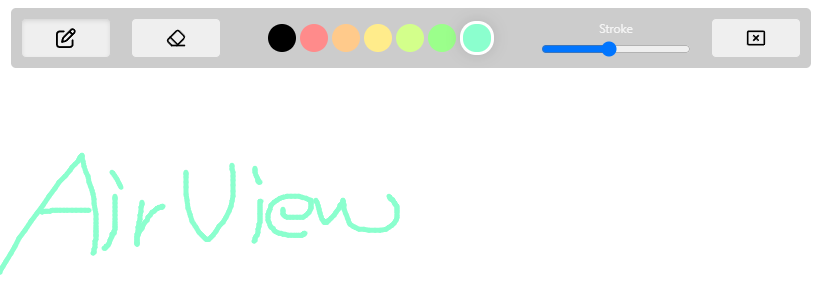
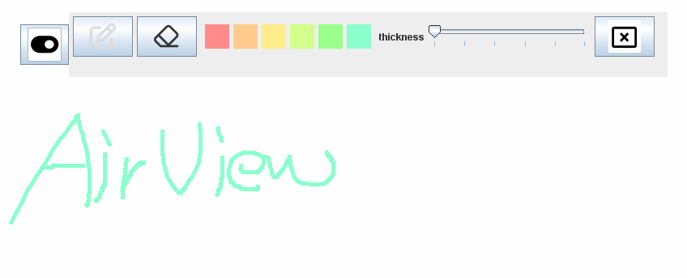

<br/><br/>

# Screen Sharing Platform
    💡 A service where you collaboratively draw pictures on each other's screens


AirView is a screen-sharing platform that supports the following features.


- __Screen Sharing__: View work on each other's devices without the need for a monitor or transmission process.
- __Quick Screen Switching__: Switch screens ridply when you want to see multiple users' screens at a glance or focus on one selected screen.
- __Drawing__: Draw on the screens when you want to provide feedback.
<br/>
----

# Initial setup
## Screen Sharing
refer these repos
- <https://github.com/TeleCAUm/airview-client>
- <https://github.com/TeleCAUm/signaling-server>

## Download and Run this airview-board
To receive drawings from Participant, the Host needs to download and run the airview-board program. This allows them to share and view drawings on their screen.
<br/>
```bash
git clone https://github.com/TeleCAUm/airview-board.git
```
Open this folder with IDE and __run Main.java__

# How to Use; Being a Host
AirView allows you to provide and receive feedback by drawing on shared screens.

## Screen Drawing Menu

- **Pen** - Start drawing on the screen.
- **Eraser** - Erase drawings on the other user's screen.
- **Palette** - Choose colors for your pen.
- **Line Thickness** - Adjust the thickness of your pen strokes.
- **X** - Exits the drawing mode.

## Toggle

<br/>
Close the toggle to stop receiving feedback.
<br/>
_On OSX, the window will be minimized._
## Get Feedback
Use the drawing menu to give feedback from **Participant** to **Host**

<br/>
The Host's screen can receive feedback through the airview-board.
